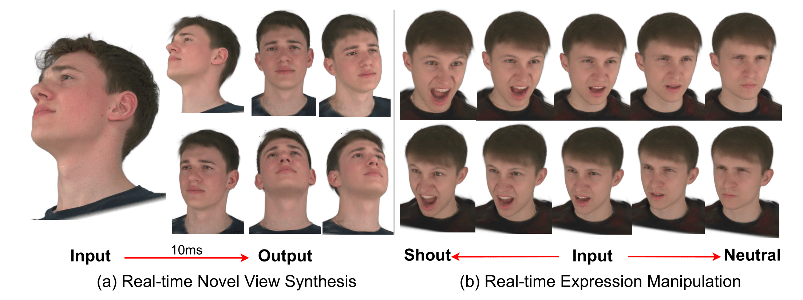

# FastAvatar: Instant 3D Gaussian Splatting for Faces from Single Unconstrained Poses

[](https://www.python.org/)
[](https://pytorch.org/)
[](LICENSE)

**[[Paper]](https://arxiv.org/pdf/2508.18389)**  **[[Website]](https://hliang2.github.io/FastAvatar/)**

<table>
  <tr>
    <td align="center"></td>
  </tr>
</table>

## Overview

We introduce FastAvatar, which achieves real-time 3D face reconstruction from a single image under unconstrained poses, combining high fidelity with speed.

### Key Features
- 🎯 **Pose-invariant 3D face reconstruction** *FastAvatar takes input photo from any pose.*
- 🔧 **Single-shot Gaussian Splatting** *FastAvatar requires only one input photo.*
- ⚡ **Real-time fitting** *FastAvatar is feed-forward, generalizable.*

## Quick Start

### Prerequisites
- Python 3.10 or higher
- CUDA 12.1 or higher (for GPU support)

### Installation

```bash
# Clone the repository
git clone https://github.com/hliang2/FastAvatar.git
cd FastAvatar

# Create virtual environment 
conda create --name fastavatar -y python=3.10
conda activate fastavatar

# Install PyTorch (adjust CUDA version as needed)
# Ignore the package warnings/errors at this step, will be fixed after requirements installed
pip install torch==2.1.0+cu121 torchvision==0.16.0+cu121 --index-url https://download.pytorch.org/whl/cu121

# Install dependencies
pip install -r requirements.txt
```

### Download Pretrained Models
All pretrained models can be downloaded **[here](https://drive.google.com/file/d/1_XPTo_1rgzxvGQcRI7Toa3iGagytPTjK/view?usp=sharing)**. 
Unzip and place them in pretrained_weights/

For the released weights, we held out subjects **128, 165, 305, 306, 369, 422** for validation.

## Basic Usage
#### Disclaimer on Dataset Bias

This project was trained on datasets that may not fully represent the diversity of real-world populations.  
As a result, the performance of the model can vary across different demographic groups (e.g., age, gender, ethnicity), and reconstructions may exhibit uneven quality.  

While our framework demonstrates strong technical capabilities, we caution against assuming universal accuracy or fairness of the outputs.  
Users are encouraged to interpret results with care and, where possible, retrain or fine-tune with more balanced datasets for broader applicability.

### Single Image Inference

Perform end-to-end inference from a single image without FLAME guidance:

```bash
# Basic single image inference
python scripts/inference_feedforward_no_guidance.py \
    --image /path/to/image.jpg \
    --encoder_checkpoint pretrained_weights/encoder_neutral_flame.pth \
    --decoder_checkpoint pretrained_weights/decoder_neutral_flame.pth \
    --dino_checkpoint pretrained_weights/dino_encoder.pth
```

### Inference with FLAME guidance (nersemble-style)

```python
# Basic Inference/test-time optimization with default parameters
python scripts/inference_feedforward_full_guidance.py

# Custom learning rates and regularization
python scripts/inference_feedforward_full_guidance.py \
    --sample_id 306 \
    --max_epochs 401 \
    --mlp_lr 2e-4 \
    --w_lr 1e-4 \
    --scale_reg 0.01 \
    --pos_reg 0.001

# Using different LPIPS network
python scripts/inference.py --sample_id 306 --lpips_net vgg
``` 

All experiment outputs are organized under the `results/` folder:

- **`images/`**  
  Contains rendered novel view images from multiple camera angles for visualization.

- **`ply/`**  
  Point cloud results for FLAME guidance based inference.

- **`splats.ply`**  
  Contains 3D point cloud reconstructions in `.ply` format. These can be visualized with any standard 3D viewer.  

- **`w_vector.npy`**  
  The predicted latent W vector used to generate the reconstruction.

- **`dino_points.npy`**  
  3D point predictions from the DINO model used as geometric guidance.

- **`dino_camera_pose.npy`**  
  Camera pose estimation from the DINO model (when available).

- **`summary.json`**  
  Comprehensive statistics and metadata about the reconstruction including Gaussian count, parameter statistics, and processing details.
  
You can use [Supersplat](https://superspl.at/editor) for interactive visualization of Gaussian-based point clouds.

## Training

### Decoder Training
Train the decoder on multiple subjects with COLMAP reconstructions:

```bash
# Basic decoder training
python scripts/train_decoder.py --data_root /path/to/multi_subject_data

# Custom learning rates and parameters
python scripts/train_decoder.py \
    --data_root /path/to/multi_subject_data \
    --max_epochs 800 \
    --mlp_lr 2e-4 \
    --w_lr 1e-4 \
    --base_lr 5e-5 \
    --l1_weight 0.6 \
    --ssim_weight 0.3 \
    --lpips_weight 0.1

# With regularization
python scripts/train_decoder.py \
    --data_root /path/to/multi_subject_data \
    --scale_reg 0.01 \
    --pos_reg 0.001
```

### Encoder Training
Train the encoder to predict W vectors from face embeddings:

```bash
# Basic encoder training (requires pretrained decoder)
python scripts/train_encoder.py \
    --data_root /path/to/multi_subject_data \
    --decoder_load_path /path/to/decoder.pth

# Custom training parameters
python scripts/train_encoder.py \
    --data_root /path/to/multi_subject_data \
    --decoder_load_path /path/to/decoder.pth \
    --encoder_lr 2e-4 \
    --batch_size 128 \
    --max_epochs 800 \
    --mse_weight 0.2 \
    --cosine_weight 0.8

# With contrastive learning
python scripts/train_encoder.py \
    --data_root /path/to/multi_subject_data \
    --decoder_load_path /path/to/decoder.pth \
    --contrastive_weight 0.1 \
    --contrastive_temperature 0.07
```

### Training Data Structure
For training multiple subjects, organize data as **[VHAP](https://github.com/ShenhanQian/VHAP)** style:

```bash
training_data/
├── 001_EXP-1_v16_DS4_whiteBg_staticOffset_maskBelowLine/
│   ├── images/           # Face images for subject 001
│   └── sparse/           # COLMAP reconstruction
├── 002_EXP-1_v16_DS4_whiteBg_staticOffset_maskBelowLine/
│   ├── images/
│   └── sparse/
└── ...
```


## Acknowledgments

This project builds upon several excellent open-source projects:

- **[gsplat](https://github.com/nerfstudio-project/gsplat)** - Efficient CUDA kernels for differentiable Gaussian rasterization from Nerfstudio
- **[InsightFace](https://github.com/deepinsight/insightface)** - State-of-the-art face analysis toolkit for face recognition and embedding
- **[VHAP](https://github.com/ShenhanQian/VHAP)** - Head Tracking with FLAME
- **[DINOv2](https://github.com/facebookresearch/dinov2)** - Image features tracking

## Citation

If you find this work useful for your research, please consider citing:

```bibtex
@article{liang2025fastavatar,
  title={FastAvatar: Instant 3D Gaussian Splatting for Faces from Single Unconstrained Poses},
  author={Liang, Hao and Ge, Zhixuan and Tiwari, Ashish and Majee, Soumendu and Godaliyadda, GM and Veeraraghavan, Ashok and Balakrishnan, Guha},
  journal={arXiv preprint arXiv:2508.18389},
  year={2025}
}
```


## Contributing

Contributions are welcome! Please feel free to submit a Pull Request. For major changes, please open an issue first to discuss what you would like to change.

## License

This project is licensed under the MIT License - see the [LICENSE](LICENSE) file for details.


**Note**: This project is for research purposes. Please ensure you have appropriate rights and consent when using face data.
